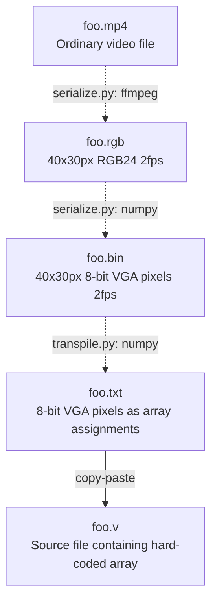

# Lab 4


Final project for **W23 COM SCI M152A: Introductory Digital Design
Laboratory**.


## [Converter](converter/)


### Setup


**Requirement:** Python 3.8+

After checking out to this branch, set up the necessary dependencies:

```sh
python -m venv .venv
source .venv/bin/activate
pip install -r requirements.txt
```

You will also need [FFmpeg](https://ffmpeg.org/download.html) installed.  You
can probably obtain it using your local package manager. For Windows, you can
download a static build and place the `ffmpeg.exe` binary some place on your
`PATH`. I used the [Chocolatey](https://chocolatey.org/) package manager for
Windows instead:

```powershell
# In an elevated PowerShell session:
choco install ffmpeg
```


### Overview


The following graphic shows the different file formats into which an input MP4
file is transformed:




### Serializing


I provided Makefile rules as front-ends for invoking my
[serialize.py](converter/serialize.py)/[transpile.py](converter/transpile.py)
scripts for building each format from the original MP4 file. Suppose it is named
`foo.mp4`.

* `make foo.rgb`: Convert to a 40x30px resolution, 2 frames-per-second, RGB24
  file.
* `make foo.bin`: Convert to a 40x30px resolution, 2 frames-per-second, 8-bit
  VGA color-encoded (`rrrgggbb` per pixel) file.
* `make foo.txt`: The same video properties as the `.bin` format but outputted
  as Verilog array assignment statements intended to be copy-pasted into a
  source file to be uploaded to the FPGA.

`foo.txt` is the final product we want at this step, and it's the file we can
transfer onto a flash drive and then onto the host machine of the Xilinx ISE.


### Visualizing


For debugging, you can use the [show.sh](show.sh) script as a shortcut for
invoking my [visualize.py](converter/visualize.py) script, which takes any of
the binary formats above and displays in a GUI the specified frame. Both frame
numbers are seconds into the video are supported. For example:

```sh
# Show the frame 8 seconds into foo.mp4:
./show.sh foo.mp4 -s 8
# Compare the coloring of the 200th frame (assuming 2fps):
./show.sh foo.bin -f 200 & ./show.sh foo.rgb -f 200 &
# Confirm that a frame txt file has the right bytes:
./show.sh foo -f 0x30 & ./how.sh foo.bin -f 0x30 &
```


### Cleanup


To clean the directory of binary and `.txt` intermediates, simply run:

```sh
make clean
```

Original MP4 video files as well as the TGZ distributables are preserved.
